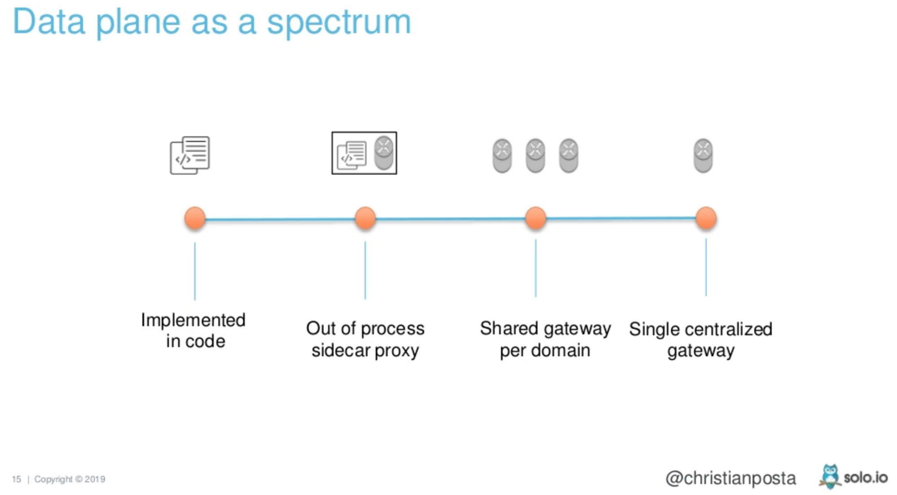
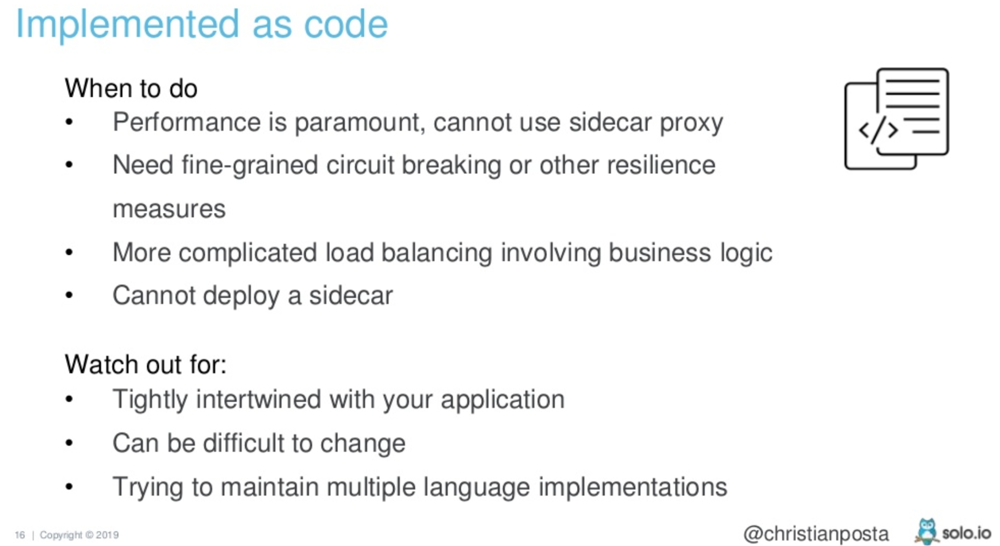
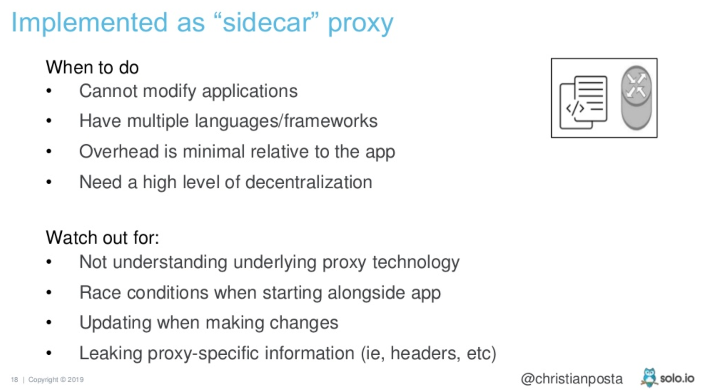
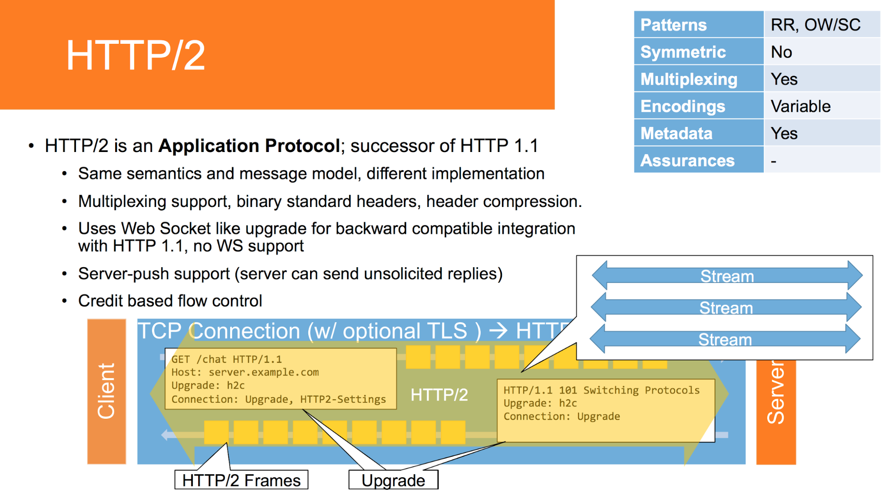
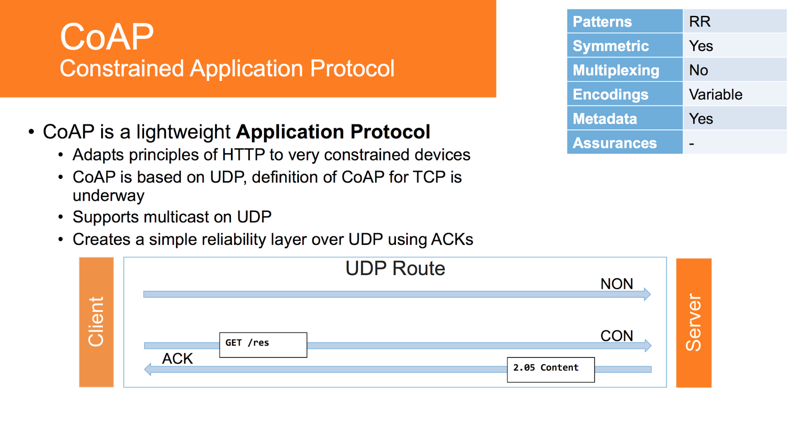

# Data distribution & database clustering {#data-distribution-&-database-clustering}

###### {"semantic":"why", "source-link":"https://learning.oreilly.com/library/view/designing-data-intensive-applications/9781491903063/", "source-author": "Martin Kleppmann"}

There are various reasons why you might want to distribute a database across multiple machines:

**Scalability**

If your data volume, read load, or write load grows bigger than a single machine can handle, you can potentially spread the load across multiple machines.

**Fault tolerance/high availability**

If your application needs to continue working even if one machine (or several machines, or the network, or an entire datacenter) goes down, you can use multiple machines to give you redundancy. When one fails, another one can take over.

**Latency**

If you have users around the world, you might want to have servers at various locations worldwide so that each user can be served from a datacenter that is geographically close to them. That avoids users having to wait for network packets to travel halfway around the world.

###### {"semantic":"tip"}

Make distinction between the availability of the storage service and reliability / durability of the storage data. If we backup our data frequently, and the database goes down, we will have our data safely store, and nothing will be lost, but the data will not be accessible. 

###### {"semantic":"explanation"}

There are two common ways data is distributed across multiple nodes: 

*   Replication and 
*   partitioning. 

They frequently goes together and brings different benefits.

###### {"semantic":"example"}

To improve read performance we can use:

*   Read replicas
*   Caching

**_Read replicas_** are special instances of our database, which have copies of data from the primary instance. After the data is written to the primary instance, it is replicated to read replicas. Writing of data can be forwarded to the primary instance, but reads are evenly distributed to all read replicas. This kind of setup has a characteristic of eventual consistency. This characteristic gives a period of time when our system is reading stale data, between the data write moment and the moment when replication occurs.

**_Caching _**provides further improvements when reading data. It is easier to configure caching in the system than read replicas, so it is recommended to first try to improve performance by caching configuration, and only then try read replicas.

## Infrastructure

### DNS

### Proxy server

### Load balancing

###### {"semantic":"explanation", "source-link":"https://www.youtube.com/watch?v=rXi5CLjIQ9k", "time-period": "00:50:42 - 00:52:54", "source-author": "Clemens Vasters", "mastery":"advanced", "tags":"message bus"}

Load leveling, how load balancers are lying to you, types of messaging infrastructure

### API Gateway 

###### {"semantic":"explanation"}

**What API Gateway can do.**

**Reverse proxy or gateway routing.** The API Gateway offers a reverse proxy to redirect or route requests (layer 7 routing, usually HTTP requests) to the endpoints of the internal microservices. The gateway provides a single endpoint or URL for the client apps and then internally maps the requests to a group of internal microservices. This routing feature helps to decouple the client apps from the microservices but it's also pretty convenient when modernizing a monolithic API by sitting the API Gateway in between the monolithic API and the client apps, then you can add new APIs as new microservices while still using the legacy monolithic API until it's split into many microservices in the future.

**Requests aggregation.** As part of the gateway pattern you can aggregate multiple client requests (usually HTTP requests) targeting multiple internal microservices into a single client request. This pattern is especially convenient when a client page/screen needs information from several microservices. With this approach, the client app sends a single request to the API Gateway that dispatches several requests to the internal microservices and then aggregates the results and sends everything back to the client app. The main benefit and goal of this design pattern is to reduce chattiness between the client apps and the backend API.

**Cross-cutting concerns or gateway offloading.** Depending on the features offered by each API Gateway product, you can offload functionality from individual microservices to the gateway, which simplifies the implementation of each microservice by consolidating cross-cutting concerns into one tier. This is especially convenient for specialized features that can be complex to implement properly in every internal microservice, such as the following functionality:

*   Authentication and authorization
*   Service discovery integration
*   Response caching
*   Retry policies, circuit breaker, and QoS
*   Rate limiting and throttling
*   Load balancing
*   Logging, tracing, correlation
*   Headers, query strings, and claims transformation
*   IP whitelisting

###### {"semantic":"cons"}

Drawbacks:

*   API Gateway coupling with the internal microservices.
*   creates an additional possible single point of failure.
*   increased response time which is still smaller than too chatty calls

## Replication

###### {"semantic":"intro-definition"}

Replication means keeping a copy of the same data on multiple machines that are connected via a network.

###### {"semantic":"why"}

There are several reasons why you might want to replicate data:

*   To keep data geographically close to your users (and thus reduce latency)
*   To allow the system to continue working even if some of its parts have failed (and thus increase availability)
*   To scale out the number of machines that can serve read queries (and thus increase read throughput)

If data is too big and cannot be stored on one machine, partitioning is applied.

###### {"semantic":warning}

Replication complexity lies in case when data is changed and different way how to synchronise it: sync/async, error handling, leader existence, consistency acceptability.

###### {"semantic":"causation"}

Data Replication 	→ Data Availability / Reliability ▲

			→ Latency ▼

			→ Read Throughput ▲ 

        → Error Resilience ▲ 

        → Cost ▲

## Partitioning / Sharding

###### {"semantic":"explanation"}

Splitting a big database into smaller subsets called partitions so that different partitions

can be assigned to different nodes (also known as shards).

Naming:

Partitioning 

= 

Sharding (MongoDB, Elasticsearch, SolrCloud) 

= 

region (HBase) 

= 

tablet (Bigtable)

 = 

vnode (Cassandra, Riak)

 = 

vBucket (Couchbase)

Usually each piece of data belongs to one partition that acts as little separate of its own database.

A node can have more partitiones. Partitioning can be done by partitioning ordered key range or hash partitioning.

###### {"semantic":"intro-definition"}

**_Partitioning _**is a technique where data is logically split into several distinct, independent parts. Partitioning is done by applying the common criteria on the primary key, and assigning a partition based on this criteria. 

###### {"semantic":"types"}

There are

*   **_Horizontal partitioning_**, which involves putting different rows into different tables. Horizontal partitioning with automatic partition assignment is the same as sharding.
*   **_Vertical partitioning_**, which involves creating tables with fewer columns and using additional tables to store the remaining columns 

Sharding improves writing performance, but makes querying data more difficult and does not improve data resiliency. 

###### {"semantic":"causation"}

Partitioning ▲ 	→ scalability ▲ 

        → complexity ▲▲

###### {"semantic":"tip"}

Replication and Partitioning is much better supported in NoSql than RDBMS. Cassandra is performing data replication and partitioning by design.

## System of record vs derived data system

###### {"semantic":"types", "source-link":"https://learning.oreilly.com/library/view/designing-data-intensive-applications/9781491903063/", "source-author": "Martin Kleppmann"}

On a high level, systems that store and process data can be grouped into two broad

Categories:

*   **Systems of record** \
A system of record, also known as source of truth, holds the authoritative version of your data. When new data comes in, e.g., as user input, it is first written here.  \
Each fact is represented exactly once (the representation is typically normalized). If there is any discrepancy between another system and the system of record, then the value in the system of record is (by definition) the correct one.
*   **Derived data systems ** \
Data in a derived system is the result of taking some existing data from another system and transforming or processing it in some way. If you lose derived data, you can recreate it from the original source.  \
A classic example is a cache: data can be served from the cache if present, but if the cache doesn’t contain what you need, you can fall back to the underlying database. Denormalized values, indexes, and materialized views also fall into this category. In recommendation systems, predictive summary data is often derived from usage logs. \
Technically speaking, derived data is redundant, in the sense that it duplicates existing information. However, it is often essential for getting good performance on read queries. It is commonly denormalized. You can derive several different datasets from a single source, enabling you to look at the data from different “points of view.”

###### {"semantic":"explanation", "source-link":"https://www.infoq.com/presentations/netflix-play-api/", "time-period": "00:29:25 - 00:31:31", "source-author": "Suudhan Rangarajan’"}

Data architecture at Netflix & materialized view

## App/Services Integration Options

###### {"semantic":"intro-definition"}

Enterprise integration is the task of making separate applications work together to produce a
unified set of functionality. Some applications may be custom developed in-house while others
are bought from third-party vendors. The applications probably run on multiple computers,
which may represent multiple platforms, and may be geographically dispersed.

###### {"semantic":"types"}

Application integration options:

*   **File Transfer** — Have each application produce files of shared data for others to consume, and consume files that others have produced. Files are a universal storage mechanism, available from any enterprise language.
*   **Shared Database** — Have the applications store the data they wish to share in a common database.
*   **Remote Procedure Invocation** — Have each application expose some of its procedures so that they can be invoked remotely, and have applications invoke those to run behavior and exchange data.
*   **Messaging** — Have each application connect to a common messaging system, and exchange data and invoke behavior using messages.

###### {"semantic":composed-of, "source-link":"https://www.youtube.com/watch?v=rXi5CLjIQ9k", "time-period": "00:38:43 - 00:40:20", "source-author": "Clemens Vasters", "mastery":"medium"}

Communication message types

###### {"semantic":"explanation", "source-link":"https://www.youtube.com/watch?v=rXi5CLjIQ9k", "time-period": "00:45:30 - 00:44:17", "source-author": "Clemens Vasters", "mastery":"medium"}

Communication characteristics

## API synchronicity style

###### {"semantic":"types"}

Communication between services can be:

*   Synchronous
*   Asynchronous

###### {"semantic":"explanation"}

With **_synchronous_** communication, a call is made to a remote server, which blocks until the operation completes. Synchronous communication can be easier to reason about. We know when things have completed successfully or not. Synchronous communication matches the _request/response_ communication style, where a client sends a request, and waits for the response.

With **_asynchronous_** communication, the caller returns immediately, and is later informed about the result of the operation. It is useful for long-running jobs, where keeping a connection open for a long period of time between the client and server is impractical. It also works very well when low latency is needed, where blocking a call while waiting for the result can slow things down. Asynchronous communication matches the _event-based_ communication style. A message is sent, carrying information about a specific event, and all listening parties are handling the event appropriately, if they are supposed to handle it. Asynchronous communication can be achieved also with request/response communication style, with the usage of callbacks.

###### {"semantic":"explanation", "source-link":"https://www.infoq.com/presentations/netflix-play-api/", "time-period": "00:19:15 - 00:26:18", "source-author": "Suudhan Rangarajan’"}

Sync-Async calls in Netflix

###### {"semantic":"explanation"}

Spot difference between underlying protocol and used client.

HTTP is a synchronous protocol - for sent requests certain responses are expected. Asynchronicity is on HTTP clients and not in the protocol.

RPC and REST clients can be both sync and async operating on sync protocol.

AMQP is async protocol but still its clients can be sync or async.

Is it usual in modern software development that async is used whenever possible because modern languages have good support and UX has good benefits. 

Sync calls between apps are considered as coupling

## API communication styles

###### {"semantic":"types"}

Depending on the decision on how do we want to have business flow implemented, we can decide on usage of one of the following communication styles:

*   Remote Procedure Call (RPC)
*   Representational State Transfer (REST)
*   Event based

###### {"semantic":"explanation", "source-link":"https://www.infoq.com/presentations/netflix-play-api/", "time-period": "00:17:15 - 00:18:40", "source-author": "Suudhan Rangarajan’"}

Rest, RPC, gRPC in Netflix

###### {"semantic":"explanation", "source-link":"https://www.youtube.com/watch?v=kb-m2fasdDY", "time-period": "00:13:18 - 00:16:00", "source-author": "Matt Ranney", "Tags":"REST disadvantages"}

Rest, RPC in Uber

### Remote Procedure Calls (RPC)

###### {"semantic":"explanation"}

**_Remote procedure call_** refers to the technique of making a local call and having it execute on a remote service somewhere. RPC implementations that allow you to generate client and server stubs help you get started very fast. 

###### {"semantic":"pros"}

One of the main selling points of RPC is its ease of use. Invoking remote services and having it implemented through a local method call makes a big benefit of RPC. 

###### {"semantic":"cons"}

Drawback of RPC is that once implemented, usually, it couples the code base to a specific technology. Even though method calls for remote procedures feel like a local call, it is not, so there may be a hidden performance bottleneck (serialization and network calls). Another drawback of RPC is that it leads to a tight server/client coupling, and every change on the server has to be propagated to all clients. 

###### {"semantic":"comparison", "source-link":"https://learning.oreilly.com/library/view/designing-data-intensive-applications/9781491903063/", "source-author": "Martin Kleppmann", "mastery":"medium"}

A network request is very different from a local function call:

*   A local function call is predictable and either succeeds or fails, depending only on parameters that are under your control. A network request is unpredictable: the request or response may be lost due to a network problem, or the remote machine may be slow or unavailable, and such problems are entirely outside of your control. Network problems are common, so you have to anticipate them, for example by retrying a failed request.
*   A local function call either returns a result, or throws an exception, or never returns (because it goes into an infinite loop or the process crashes). A network request has another possible outcome: it may return without a result, due to a timeout. In that case, you simply don’t know what happened: if you don’t get a response from the remote service, you have no way of knowing whether the request got through or not.
*   If you retry a failed network request, it could happen that the requests are actually getting through, and only the responses are getting lost. In that case, retrying will cause the action to be performed multiple times, unless you build a mechanism for deduplication (idempotence) into the protocol. Local function calls don’t have this problem. 
*   Every time you call a local function, it normally takes about the same time to execute. A network request is much slower than a function call, and its latency is also wildly variable: at good times it may complete in less than a millisecond, but when the network is congested or the remote service is overloaded it may take many seconds to do exactly the same thing.
*   When you call a local function, you can efficiently pass it references (pointers) to objects in local memory. When you make a network request, all those parameters need to be encoded into a sequence of bytes that can be sent over the network. That’s okay if the parameters are primitives like numbers or strings, but quickly becomes problematic with larger objects.
*   The client and the service may be implemented in different programming languages, so the RPC framework must translate datatypes from one language into another. This can end up ugly, since not all languages have the same types

### Representational State Transfer (REST)

###### {"semantic":"explanation"}

**_REpresentational State Transfer (REST)_** is an architectural style inspired by the Web. The server creates different representations of a resource on request. How a resource is shown externally is completely decoupled from how it is stored internally. The REST architectural style describes that actions should behave the same way on all resources, and the HTTP specification defines a set of methods that go along well with this requirement. HTTP also brings a large ecosystem of supporting tools and technology. There are many tools to easen working with systems who have their APIs exposed via REST, such as HTTP caching proxies like _Varnish_ and load balancers like _mod_proxy_, many monitoring tools already have lots of support for HTTP out of the box. These tools allow handling of large volumes of HTTP traffic and route them smartly, in a fairly transparent way. Also, with the use of client certificates, a layer of security can be added to REST.

REST over HTTP payloads can be quite compact because of support to alternative formats like JSON or even binary, but still it is not as compact as some RPC implementations which use binary protocols. The overhead of HTTP for each request may also be a concern for low-latency requirements. HTTP, while it can be suited well to large volumes of traffic, isn’t great for low-latency communications when compared to alternative protocols that are built on top of Transmission Control Protocol (TCP) or other networking technology.

For server-to-server communications, if extremely low latency or small message size is important, HTTP communications in general may not be a good idea. Choosing an underlying protocol, such as User Datagram Protocol (UDP), may help achieve the performance that is needed.

###### {"semantic":pros, "source-link":"https://learning.oreilly.com/library/view/designing-data-intensive-applications/9781491903063/", "source-author": "Martin Kleppmann", "mastery":"medium"}

Custom RPC protocols with a binary encoding format can achieve better performance than something generic like JSON over REST. However, a RESTful API has other significant advantages: it is good for experimentation and debugging (you can simply make requests to it using a web browser or the command-line tool curl, without any code generation or software installation), it is supported by all mainstream programming languages and platforms, and there is a vast ecosystem of tools available (servers, caches, load balancers, proxies, firewalls, monitoring, debugging tools, testing tools, etc.).

###### {"semantic":"comparison", "source-link":"https://learning.oreilly.com/library/view/designing-data-intensive-applications/9781491903063/", "source-author": "Martin Kleppmann", "mastery":"medium"}

For these reasons, REST seems to be the predominant style for public APIs. The main focus of RPC frameworks is on requests between services owned by the same organization, typically within the same datacenter.

### Event Based Mechanisms

###### {"semantic":"explanation"}

There are two main parts that need to be considered here: a way for microservices to emit events, and a way for consumers to find out those events have happened. Message brokers like _RabbitMQ_ try to handle both problems. 

Producers use an API to publish an event to the broker. The broker handles subscriptions, allowing consumers to be informed when an event arrives. These brokers can even handle the state of consumers. These systems are normally designed to be scalable and resilient, but in return, it can add complexity to the development process, because it is yet another system needed to run. Additional machines and expertise may also be required to keep this infrastructure up and running.

A general recommendation is that the middleware, queues used to propagate events between services, should be kept as dumb as possible, and business logic should be pushed in services.

Event-driven architectures seem to lead to significantly more decoupled, scalable systems. However, these programming styles do lead to an increase in complexity. This isn’t just the complexity required to manage publishing and subscribing to messages, but there are other problems.

For example, when considering long-running async request/response, it needs to be considered what to do when the response comes back. Does it come back to the same node that initiated the request? If so, what if that node is down? If not, does the information need to be stored somewhere so that the system can react accordingly?

In event based systems, with many services exchanging events, it is critical to have good monitoring, so that it is clear in which stage of processing a certain task is. It is also important to be able to track, and replay, failed messages. 

###### {"semantic":pros, "source-link":"https://learning.oreilly.com/library/view/designing-data-intensive-applications/9781491903063/", "source-author": "Martin Kleppmann", "mastery":"medium"}

Using a message broker has several advantages compared to direct RPC:

*   It can act as a buffer if the recipient is unavailable or overloaded, and thus improve system reliability.
*   It can automatically redeliver messages to a process that has crashed, and thus prevent messages from being lost.
*   It avoids the sender needing to know the IP address and port number of the recipient (which is particularly useful in a cloud deployment where virtual machines often come and go).
*   It allows one message to be sent to several recipients.
*   It logically decouples the sender from the recipient (the sender just publishes messages and doesn’t care who consumes them).

## API

###### {"semantic":"intro-definition", "source-link":"https://blog.christianposta.com/microservices/api-gateways-are-going-through-an-identity-crisis/", "source-author": "Christian Posta"}

API: An explicitly and purposefully defined interface designed to be invoked over a network that enables software developers to get programmatic access to data and functionality within an organization in a controlled and comfortable way.

These interfaces abstract the details of the technology infrastructure that implements them. For these designed network endpoints, we expect some level of documentation, usage guidance, stability and backwards compatibility.

In contrast, just because we can communicate with another piece of software over the network does not necessarily mean that remote endpoint is an API by this definition. Lots of systems communicate with each other, however that communication happens more haphazardly and trades off immediacy with coupling and other factors.

**“API management” perspective of API**

API management solves the problem of “we have these existing, curated, APIs that we want to share with others but share them on our terms”. We are thinking in terms of APIs and how best to manage and allow access to them. We are not thinking in terms of servers, hosts, ports, containers, or even services.

**“API Gateway” perspective of API**

API gateway is a server that acts as an API front-end. It is the API for clients and applications and is responsible for communicating with any backend APIs and other application network endpoints (those that don’t meet the aforementioned definition of API)

Examples of API Management software that leverages an API gateway:

*   [Google Cloud Apigee](https://apigee.com/api-management/#/homepage)
*   [Red Hat 3Scale](https://www.3scale.net/)
*   [Mulesoft](https://www.mulesoft.com/)
*   [Kong](https://konghq.com/)

**“Infrastructure / Cluster Ingress” perspective of API**

Examples of these types of ingress implementations include:

*   Envoy Proxy and projects that build upon it including:
    *   [Datawire Ambassador](https://www.getambassador.io/)
    *   [Solo.io Gloo](https://gloo.solo.io/)
    *   [Heptio Contour](https://github.com/heptio/contour)
*   HAproxy
    *   Including [OpenShift’s Router](https://docs.openshift.com/container-platform/3.9/install_config/router/index.html)
*   [NGINX](https://github.com/kubernetes/ingress-nginx)
*   [Traefik](https://traefik.io/)
*   [Kong](https://github.com/Kong/kubernetes-ingress-controller)

**Overall perspective**

The _issues at the boundary of an application architecture_ are not the same as those within the boundary. 

API gateways live above the applications/services regardless of whether a service mesh exists and provides an abstraction to other groups. A core functionality of the API Gateway is to provide a stable API interface to clients outside of the boundary. 

service mesh gives more details/fidelity to the services/clients about the implementation of the rest of architecture. The service mesh operates at a lower level than the API Gateway and on all of the individual services within the architecture. All of these implementation details are provided to applications typically by some sidecar process

###### {"semantic":"explanation", "source-link":"https://www.slideshare.net/ceposta/the-truth-about-the-service-mesh-data-plane", "source-author": "Christian Posta"}

###### {"semantic":"explanation", "source-link":"https://blog.christianposta.com/microservices/application-network-functions-with-esbs-api-management-and-now-service-mesh/", "source-author": "Christian Posta"}

###### {"semantic":"explanation"}

Capabilities area of general API management are listed below. They are usually implemented to different degrees by different providers like API Gateways, Service Mashes, Message Brokers, ESBs… They are ordered from higher order function to lower :

*   passes requests to the back-end service and then passes the response back to the requester - “backend for frontends” where “front end” can be literal front ends (UIs), mobile clients, IoT clients, or even other service/application developers
*   Documentation
*   Monetization **& **sign up to different plans for API consumption (think: numbers of calls per user per endpoint within a given time frame for a specified price point)
*   Service discovery
*   Reporting, analytics & metrics collection
*   API composition
*   Load balancing
*   Traffic splitting & Canary releasing
*   transformation engine to orchestrate and modify the requests and responses on the fly
*   Caching
*   Rate-limiting & throttling
*   authentication/authorizations &  security policies
*   audit and regulatory compliance
*   TLS termination/origination
*   Application protocol transformations
*   traffic routing
*   circuit breaking
*   Timeout management
*   Retries management

###### {"semantic":warning, "source-link":"https://blog.christianposta.com/microservices/application-network-functions-with-esbs-api-management-and-now-service-mesh/", "source-author": "Christian Posta"}

When we have some kind of centralized governance we run the risk of wanting to accomplish too many things with it. For example, as API calls are coming through our gateway why don’t we just add things like routing, transformation, and orchestration? The problem with this is we start going down the path of building an ESB which combines infrastructure level networking concerns with business logic. And this is a dead end. 

Two main problems with ESB that we have to be extra careful not to repeat with API Gateway are:

*   technology was complicated (SOAP/WS-*, JBI, Canonical XML, proprietary formats, etc)
*   business logic was needed to implement things like mapping, content-based routing, transformation, mediation, orchestration, etc

## BLOB handling

###### {"semantic":"explanation"}

**What is the best way to send/receive BLOBs?**

Can be sent as service parameter or as independent service call where is hard to guarantee transaction completeness.

It is advisie to send image with HTTP encoding application/x-www-form-urlencoded. It is possible to send it as regular json where image would be Base64 encoded

HTML forms provide three methods of encoding, expressed in attribute enctype.

*   application/x-www-form-urlencoded - the default content-type. This type is just a list of keys and values and is therefore not fit for uploading files.
*   multipart/form-data - browsers use to upload files through HTML forms
*   multipart/byteranges - send arbitrary bytes from a resource, enabling clients to resume downloads
*   text/plain - only for debugging

###### {"semantic":"comparison"}

**Base64 encoding vs. Multipart form data**

Base64-encoded files can be easily used by JSON and XML APIs since they are represented as text and can be sent through the standard application/json format. However, the encoding increases the file size by 33%, making it difficult to transfer larger files. Encoding and decoding also adds a computational overhead for both the server and the client. Therefore, base64 is suitable for sending images and small files under 100MB.

Multipart forms, on the other hand, are more "unnatural" to the APIs, since the data is encoded in a different format and requires a different way of handling. However, the increased performance with larger files and the ability to stream files makes multipart form data more desirable for uploading large files, such as videos.

Node: sending 3MB of BLOB can take between 1 and 2 seconds which requires additional UI handling to maintain good UX

## 

## Communication protocols

### TCP, IP, UDP

###### {"semantic":warning, "source-link":"https://www.youtube.com/watch?v=Esg1BYJdZe0", "time-period": "00:10:55 - 00:12:24", "source-author": "Clemens Vasters", "mastery":"advanced"}

Why UDP is not ideal protocol, UDP vs TCP

### HTTP

###### {"semantic":"explanation", "source-link":"https://www.youtube.com/watch?v=rXi5CLjIQ9k", "time-period": "00:47:42 - 00:48:00", "source-author": "Clemens Vasters", "mastery":"medium"}

HTTP/1.1

###### {"semantic":"explanation", "source-link":"https://gotocon.com/dl/goto-amsterdam-2016/slides/ClemensVasters_MessagingAndMicroservices.pdf", "source-author": "Clemens Vasters", "mastery":"medium"}

###### {"semantic":"explanation", "source-link":"https://www.youtube.com/watch?v=rXi5CLjIQ9k", "time-period": "00:48:38 - 00:48:14", "source-author": "Clemens Vasters", "mastery":"medium"}

HTTP/2

###### {"semantic":"explanation", "source-link":"https://gotocon.com/dl/goto-amsterdam-2016/slides/ClemensVasters_MessagingAndMicroservices.pdf", "source-author": "Clemens Vasters", "mastery":"medium"}

### Web sockets

###### {"semantic":"explanation", "source-link":"https://www.youtube.com/watch?v=rXi5CLjIQ9k", "time-period": "00:48:00 - 00:48:37", "source-author": "Clemens Vasters", "mastery":"medium"}

Web Sockets

###### {"semantic":"explanation", "source-link":"https://gotocon.com/dl/goto-amsterdam-2016/slides/ClemensVasters_MessagingAndMicroservices.pdf", "source-author": "Clemens Vasters", "mastery":"medium"}

### CoAP

###### {"semantic":"explanation", "source-link":"https://www.youtube.com/watch?v=rXi5CLjIQ9k", "time-period": "00:49:15 - 00:49:52", "source-author": "Clemens Vasters", "mastery":"medium"}

CoAP

###### {"semantic":"explanation", "source-link":"https://gotocon.com/dl/goto-amsterdam-2016/slides/ClemensVasters_MessagingAndMicroservices.pdf", "source-author": "Clemens Vasters", "mastery":"medium"}

### MQTT

###### {"semantic":"explanation", "source-link":"https://www.youtube.com/watch?v=rXi5CLjIQ9k", "time-period": "00:49:54 - 00:50:05", "source-author": "Clemens Vasters", "mastery":"medium"}

MQTT

###### {"semantic":"explanation", "source-link":"https://gotocon.com/dl/goto-amsterdam-2016/slides/ClemensVasters_MessagingAndMicroservices.pdf", "source-author": "Clemens Vasters", "mastery":"medium"}

### AMQP

###### {"semantic":"explanation", "source-link":"https://www.youtube.com/watch?v=rXi5CLjIQ9k", "time-period": "00:50:06 - 00:50:33", "source-author": "Clemens Vasters", "mastery":"medium"}

AMQP

###### {"semantic":"explanation", "source-link":"https://gotocon.com/dl/goto-amsterdam-2016/slides/ClemensVasters_MessagingAndMicroservices.pdf", "source-author": "Clemens Vasters", "mastery":"medium"}

## Messaging systems

###### {"semantic":"comparison"}

<table>
  <tr>
   <td>
   </td>
   <td><strong>Kafka</strong>
   </td>
   <td><strong>RabbitMQ</strong>
   </td>
  </tr>
  <tr>
   <td><strong>Throughput</strong>
   </td>
   <td>100k messages / s for one node
   </td>
   <td>Typically 5k - 15k messages / s for one node (for 1M you need 30+ nodes), message size 4 kB, should be smaller than 100kB
   </td>
  </tr>
  <tr>
   <td><strong>Recommended message size</strong>
   </td>
   <td><1MB
   </td>
   <td><100kB
   </td>
  </tr>
  <tr>
   <td><strong>Clustering</strong>
   </td>
   <td>By design
   </td>
   <td>Yes but not by design
   </td>
  </tr>
  <tr>
   <td><strong>Model</strong>
   </td>
   <td>Dumb broker / smart consumer model, durable message storage, primary pull-based approach
   </td>
   <td>Smart broker / dumb consumer, not intended as durable message storage, primary push-based approach
   </td>
  </tr>
  <tr>
   <td><strong>Setup difficulty</strong>
   </td>
   <td>Medium
   </td>
   <td>Easy for one node, Hard for cluster
   </td>
  </tr>
  <tr>
   <td><strong>Message ordering</strong>
   </td>
   <td>Yes within a partition
   </td>
   <td>No
   </td>
  </tr>
  <tr>
   <td><strong>Performance</strong>
   </td>
   <td>High event for limited hardware
   </td>
   <td>Medium and hardware demanding
   </td>
  </tr>
  <tr>
   <td><strong>Message priority</strong>
   </td>
   <td>No
   </td>
   <td>Yes
   </td>
  </tr>
  <tr>
   <td><strong>Protocols</strong>
   </td>
   <td>Binary
   </td>
   <td>AMQP, MQTT, HTTP
   </td>
  </tr>
  <tr>
   <td><strong>Most suitable for cases</strong>
   </td>
   <td>
<ul>

<li>Many consumers for the same message

<li>Streams of data

<li>Replicability

<li>High availability

<li>Message order, 

<li>event sourcing, 

<li>‘replay’ of history data
</li>
</ul>
   </td>
   <td>
<ul>

<li>when web servers need to quickly respond to requests (RPC style), 

<li>convey a message to various recipients for consumption or to share loads between workers, 

<li>Complex routing to consumers including wildcards, 

<li>Applications that need a variety of publish/subscribe, 

<li>point-to-point request/reply messaging capabilities.  

<li>Priority Queue

<li>A standard protocol message queue
</li>
</ul>
   </td>
  </tr>
</table>

### Kafka

###### {"semantic":"explanation", "source-link":"https://www.youtube.com/watch?v=KrrnUrPWUZY", "time-period": "00:09:32 - 00:13:41", "source-author": "Viktor Gamov"}

Storage aspect 

###### {"semantic":"explanation", "source-link":"https://www.youtube.com/watch?v=KrrnUrPWUZY", "time-period": "00:13:42 - 00:28:34", "source-author": "Viktor Gamov"}

Pub/sub aspect

###### {"semantic":cons, "source-link":"https://www.youtube.com/watch?v=KrrnUrPWUZY", "time-period": "00:20:50 - 00:21:48", "source-author": "Viktor Gamov"}

Random access limitation

###### {"semantic":cons, "source-link":"https://www.youtube.com/watch?v=KrrnUrPWUZY", "time-period": "00:22:14 - 00:22:24", "source-author": "Viktor Gamov"}

Comment on how not easy it is to manage Kafka on your own

###### {"semantic":"explanation", "source-link":"https://www.youtube.com/watch?v=KrrnUrPWUZY", "time-period": "00:29:23 - 00:32:44", "source-author": "Viktor Gamov"}

Replication

###### {"semantic":"explanation", "source-link":"https://www.youtube.com/watch?v=KrrnUrPWUZY", "time-period": "00:46:05 - 00:54:25", "source-author": "Viktor Gamov"}

Processing

###### {"semantic":example, "source-link":"https://www.youtube.com/watch?v=KrrnUrPWUZY", "time-period": "00:46:30 - 00:51:41", "source-author": "Viktor Gamov"}

Processing example

###### {"semantic":use-case, "source-link":"https://www.youtube.com/watch?v=KrrnUrPWUZY", "time-period": "00:51:38 - 00:54:25", "source-author": "Viktor Gamov"}

Which feature is for who

###### {"semantic":"explanation", "source-link":"https://www.youtube.com/watch?v=BuE6JvQE_CY", "time-period": "00:00:43 - 00:25:48", "source-author": "Martin Kleppmann", "mastery":"advanced"}

Kafka through ACID

###### {"semantic":"explanation", "source-link":"https://www.youtube.com/watch?v=avi-TZI9t2I", "time-period": "00:18:24 - 00:40:10", "source-author": "Martin Kleppmann", "mastery":"medium", Tag=’example"}

Kafka overall explanation

###### {"semantic":use-case}

Use Kafka if:

*   you have a fire hose of events (20k+/sec per producer)
*   you need delivered in partitioned order 'at least once' with a mix of online and batch consumers
*   **_you’re OK with your consumers managing the state of your “cursor” on the Kafka topic_**
*   **_main superpower is that it is less like a queue system and more like a circular buffer that scales as much as your disk on your cluster, and thus allows you to be able to re-read messages._**
*   producer-centric, based around partitioning a fire hose of event data into durable message brokers with cursors, supporting batch consumers that may be offline, or online consumers that want messages at low latency.
*   doesn't have message acknowledgements, it assumes the consumer tracks of what's been consumed so far
*   simple routing approach
*   **presumes that producers generate a massive stream of events on their own timetable **- there's no room for throttling producers because consumers are slow, since the data is too massive. The whole job of Kafka is to provide the "shock absorber" between the flood of events and those who want to consume them in their own way -- some online, others offline - only batch consuming on an hourly or even daily basis.
*   leverages the powers of sequential disk I/O and requires less hardware
*   employs a dumb broker and uses smart consumers to read
*   does not attempt to track which messages were read by each consumer
*   can support a large number of consumers and retain large amounts of data with very little overhead
*   does require external services to run - in this case Apache Zookeeper, which is often regarded as non-trivial to understand, setup and operate
*   your application needs access to stream history, delivered in partitioned order at least once
*   clients can get a “replay” of the event stream on demand, as opposed to more traditional message brokers where once a message has been delivered, it is removed from the queue.
*   Stream Processing
*   Event Sourcing
*   Use cases: messaging, app activity tracking, metrics and monitoring, log aggregation, stream processing, event sourcing, commit log

### RabbitMQ

###### {"semantic":use-case}

Use RabbitMQ

*   you have messages (20k+/sec per queue) that need to be routed in complex ways to consumers
*   you want per-message delivery guarantees
*   you need one or more features of protocols like AMQP 0.9.1, 1.0, MQTT, or STOMP
*   **_you want the broker to manage that state of which consumer has been delivered which message_**.
*   superpowers are that it’s a **_scalable, high performance queue system_** with **well-defined consistency rules**, and **ability to create interesting exchange topologies**.
*   **broker-centric**, focused around delivery guarantees between producers and consumers, with transient preferred over durable messages.
*   uses the broker itself to maintain state of what's consumed (via message acknowledgements
*   presumes that consumers are mostly online, and any messages "in wait" (persistent or not) are held opaquely (i.e. no cursor)
*   rich routing capabilities
*   ensures queued messages are stored in published order
*   handles its messages largely in-memory and thus uses a large cluster
*   employing several variations of point to point, request/reply and pub-sub communication styles patterns
*   smart broker / dumb consumer model, focused on consistent delivery of messages to consumers that consume at a roughly similar pace as the broker keeps track of consumer state. 
*   Supported synchronous or asynchronous communication
*   does not have dependencies on external services
*   Use cases: messaging, Asynchronous Command Calls where messages are point-to-point - queues instead of topics where requred delivery guarantee and messages are short-lived (complex flows often requires proper orchestration over asynchronous actions), atomic messages exchanged between parties, instead of a constant stream of events potentially handled by multiple processes.

