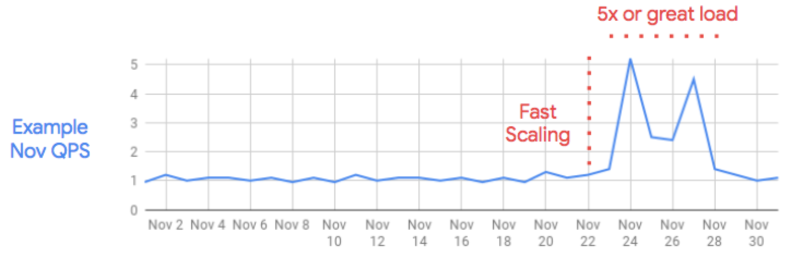
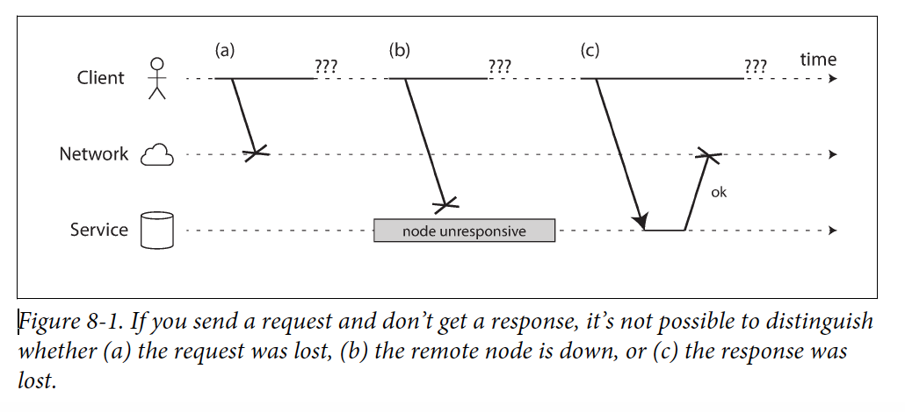
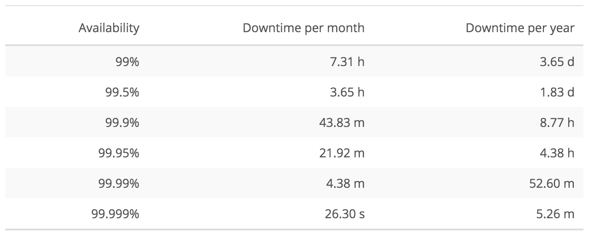
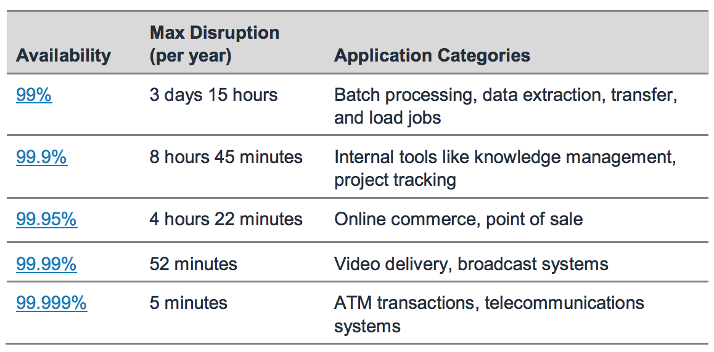

# Key System Characteristics 

###### {"semantic":"composed-of"}

List of system key characteristics that significantly influences system design is:

*   Scalability (Elasticity)
*   Failure resilience (Availability, Reliability)
*   Performance
*   Best practices

## Scalability 

###### {"semantic":"intro-definition"}

Scalability is the capability of a system to grow and manage increased demand (data amount or processing power).

###### {"semantic":"example"}

Exit festival: 9k tickets in first 1h (average 2.5 ticket/s or 1.5k req/s; peak 20 ticket/s or 12k req/s)

###### {"semantic":"example"}

Online shop traffic example that has to be ‘Black Friday Ready’

###### {"semantic":"example"}

The film ‘Toy Story’ = 3 h/frame -> Entire movie = 36 year / computer

###### {"semantic":"why"}

Scaling can be performed for two reasons:

*   Failure
*   Performance

**_Scaling for failure_** allows us to have one application instance take over in case of a failure of another instance.

**_Scaling for performance_** allows us to split the workload over several machines in case of an increased load.

###### {"semantic":"warning"}

Why is scalability so hard? Two main reasons:

*   It cannot be an after-thought. System has to be designed well initially
*   It must handle heterogeneity that occurs throughout time (new hardware and software with different protocols, hardware capacities and architecture styles)

###### {"semantic":"types"}

Scaling can be achieved by adding hardware resources in two ways:

*   Vertical (scale out / scale in)
*   Horizontal (scale up / scale down)

**_Vertical scaling_** means that we use hardware with more power, in order to be able to have higher load, on a single instance. Vertical scaling does not give failure tolerance, if the instance is down, there is no other instance to take over. Usually involves downtime and hardware constraints (e.g. up to 256MB RAM per server).

###### {"semantic":"remember"}

More hardware capacities bring costs that grows faster than linearly and hardware utilization decreases, making inefficiency twofold.

**_Horizontal scaling_** means that we use more smaller instances and split the load between them. This way of scaling also gives us failure tolerance.Easy to do it dynamically.

For horizontal scaling, we use **_load balancers_, **in front of our instances, in order to evenly distribute the load by an algorithm.

###### {"semantic":"warning"}

Load balancer can be a single point of failure, just the same as database instance shared among micro services.

###### {"semantic":"remember"}

The system has a **performance problem** if it is slow for a single user.

The system has a **scalability problem** if it is fast for a single user, but slow for multiple users.

###### {"semantic":"explanation"}

**Elasticity has almost the same meaning as scalability -** it is the degree to which a system is able to adapt to workload changes by provisioning and de-provisioning resources in an autonomic manner, such that at each point in time the available resources match the current demand as closely as possible.

###### {"semantic":"explanation"}

In order to scale properly, appropriate architecture has to be selected. Twitter in its first version just inserted twits in a normalized schema and during fetch for ‘home timeline’ constructed data. This was slow. Since Twitter is read heavy, it is better to use architecture that creates a materialized view during insert, lowering processing during read. They changed architecture in this direction and performance was drastically better. They kept the original approach for extremely popular accounts since they require too much processing. Place processing on less frequent data flow. Lesson - know the nature of your system and select architecture accordingly. 

## Fault resilience: Availability and Reliability 

###### {"semantic":"intro-definition"}

Availability is the time a system remains operational even in case of software, hardware or human error. Reliability is the probability that a system will fail in a given period.

###### {"semantic":"example"}

In August 2013, Amazon went down for 15 minutes (both web and mobile services), and ended up losing over $66000 per minute. 

###### {"semantic":"metrics", "source-link":"https://learning.oreilly.com/library/view/designing-data-intensive-applications/9781491903063/", "source-author":"Martin Kleppmann"}

Hard disks are reported as having a mean time to failure (MTTF) of about 10 to 50 years. Thus, on a storage cluster with 10,000 disks, we should expect on average one disk to die per day.

###### {"semantic":"types"}

There are two types of downtimes:

*   scheduled and 
*   unscheduled. 

Ideal case: 24/7 availability

Hard but possible to achieve: ‘five 9s’ (99.999 percent) availability

###### {"semantic":"remember"}

Basic principle to achieve high failure resilience is to remove system components which are single point of failure.

###### {"semantic":"causation"}

Availability / Reliability ▲ → system outage ▼ → cost ▲▲

###### {"semantic":"causation"}

System components ▲ → complexity ▲ → availability / reliability ▼ 

###### {"semantic":"warning"}

A decision must be made on whether the extra uptime is truly worth the amount of money that has to go into it. It must be clear how damaging potential downtimes can be for the company and how important system services are in running a business. This is also important for planning scheduled outages.

###### {"semantic":"example"}

How to achieve it:

*   Multiple application servers (processing reliability)
*   Data distribution and recovery strategy (storage reliability)
*   Load balancing (processing and storage distribution)
*   Establishing issue detection and automated issue recovery mechanisms

###### {"semantic":"remember"}

In order to determine overall system availability, it is important to know all its external systems availabilities

###### {"semantic":"remember", "source-link":"https://learning.oreilly.com/library/view/designing-data-intensive-applications/9781491903063/)", "source-author":"Martin Kleppmann"}

Even in “non critical” applications we have a responsibility to our users. Consider a parent who stores all their pictures and videos of their children in your photo application. How would they feel if that database was suddenly corrupted? 

###### {"semantic":"example", "source-link":"https://learning.oreilly.com/library/view/designing-data-intensive-applications/9781491903063/)", "source-author":"Martin Kleppmann"}

The things that can go wrong are called **faults**, and systems that anticipate faults and can cope with them are called fault-tolerant or resilient. The former term is slightly misleading: it suggests that we could make a system tolerant of every possible kind of fault, which in reality is not feasible. If the entire planet Earth (and all servers on it) were swallowed by a black hole, tolerance of that fault would require web hosting in space.

Note that a fault is not the same as a **failure**. A fault is usually defined as one component of the system deviating from its spec, whereas a failure is when the system as a whole stops providing the required service to the user. 

###### {"semantic":"remember", "source-link":"https://learning.oreilly.com/library/view/designing-data-intensive-applications/9781491903063/)", "source-author":"Martin Kleppmann"}

It is impossible to reduce the probability of a fault to zero; therefore it is usually best to design fault-tolerance mechanisms that prevent faults from causing failures. Many critical bugs are actually due to poor error handling.

###### {"semantic":"example", "source-link":"https://learning.oreilly.com/library/view/designing-data-intensive-applications/9781491903063/)", "source-author":"Martin Kleppmann"}

Hard disks are reported as having a mean time to failure (MTTF) of about 10 to 50 years. Thus, on a storage cluster with 10,000 disks, we should expect on average one disk to die per day.

###### {"semantic":"warning", "source-link":"https://learning.oreilly.com/library/view/designing-data-intensive-applications/9781491903063/)", "source-author":"Martin Kleppmann"}

One study of large internet services found that configuration errors by operators were the leading cause of outages, whereas hardware faults (servers or network) played a role in only 10–25% of outages.

###### {"semantic":"example", "source-link":"https://learning.oreilly.com/library/view/designing-data-intensive-applications/9781491903063/)", "source-author":"Martin Kleppmann"}

Implementing fault tolerance mechanisms is a lot of work.

Working with distributed systems is fundamentally different from writing software on a single computer—and the main difference is that there are lots of new and exciting ways for things to go wrong. That is the reason why it is hard to work with distributed system.

An individual computer with good software is usually either fully functional or entirely broken, but not something in between. Or to be more accurate, that ‘something between’ is extremely low probable.

When you are writing software that runs on several computers, connected by a network, the situation is fundamentally different. In distributed systems, we are no longer operating in an idealized system model—we have no choice but to confront the messy reality of the physical world - partial failure. Sometimes it is not possible to determine if something works on not, for example message sending across network.

###### {"semantic":"tip", "source-link":"https://learning.oreilly.com/library/view/designing-data-intensive-applications/9781491903063/)", "source-author":"Martin Kleppmann"}

Intuitively it may seem like a system can only be as reliable as its least reliable component (its weakest link ). This is not the case: in fact, it is an old idea in computing to construct a more reliable system from a less reliable underlying base.  For example:

*   Error-correcting codes allow digital data to be transmitted accurately across a communication channel that occasionally gets some bits wrong, for example due to radio interference on a wireless network.
*   IP (the Internet Protocol) is unreliable: it may drop, delay, duplicate, or reorder packets. TCP (the Transmission Control Protocol) provides a more reliable transport layer on top of IP: it ensures that missing packets are retransmitted, duplicates are eliminated, and packets are reassembled into the order in which they were sent.

Although the system can be more reliable than its underlying parts, there is always a limit to how much more reliable it can be.

###### {"semantic":"explanation", "source-link":"https://learning.oreilly.com/library/view/designing-data-intensive-applications/9781491903063/)", "source-author":"Martin Kleppmann"}

The internet and most internal networks in data centers (often Ethernet) are asynchronous packet networks. In this kind of network, one node can send a message (a packet) to another node, but the network gives no guarantees as to when it will arrive, or whether it will arrive at all. If you send a request and expect a response, many things could go wrong:

*   Your request may have been lost (perhaps someone unplugged a network cable).
*   Your request may be waiting in a queue and will be delivered later (perhaps the network or the recipient is overloaded).
*   The remote node may have failed (perhaps it crashed or it was powered down).
*   The remote node may have temporarily stopped responding (perhaps it is experiencing a long garbage collection pause), but it will start responding again later.
*   The remote node may have processed your request, but the response has been lost on the network (perhaps a network switch has been misconfigured).
*   The remote node may have processed your request, but the response has been delayed and will be delivered later (perhaps the network or your own machine is overloaded).

The sender can’t even tell whether the packet was delivered: the only option is for the recipient to send a response message, which may in turn be lost or delayed. These issues are indistinguishable in an asynchronous network: the only information you have is that you haven’t received a response yet. If you send a request to another node and don’t receive a response, it is impossible to tell why. The usual way of handling this issue is a timeout: after some time you give up waiting and assume that the response is not going to arrive. However, when a timeout occurs, you still don’t know whether the remote node got your request or not.

###### {"semantic":"example", "source-link":"https://learning.oreilly.com/library/view/designing-data-intensive-applications/9781491903063/)", "source-author":"Martin Kleppmann"}

TCP Versus UDP

Some latency-sensitive applications, such as videoconferencing and Voice over IP (VoIP), use UDP rather than TCP. It’s a trade-off between reliability and variability of delays: as UDP does not perform flow control and does not retransmit lost packets, it avoids some of the reasons for variable network delays (although it is still susceptible to switch queues and scheduling delays). UDP is a good choice in situations where delayed data is worthless. For example, in a VoIP phone call, there probably isn’t enough time to retransmit a lost packet before its data is due to be played over the loudspeakers. In this case, there’s no point in retransmitting the packet—the application must instead fill the missing packet’s time slot with silence (causing a brief interruption in the sound) and move on in the stream. The retry happens at the human layer instead. (“Could you repeat that please? The sound just cut out for a moment.”)

###### {"semantic":"metrics"}

**Availability nines and SLA**

There are three principles of [systems design](https://en.wikipedia.org/wiki/Systems_design) in [reliability engineering](https://en.wikipedia.org/wiki/Reliability_engineering)** **

*   Elimination of [single points of failure](https://en.wikipedia.org/wiki/Single_point_of_failure). This means adding redundancy to the system so that failure of a component does not mean failure of the entire system.
*   Reliable crossover. In [redundant systems](https://en.wikipedia.org/wiki/Redundancy_(engineering)), the crossover point itself tends to become a single point of failure. Reliable systems must provide for reliable crossover.
*   Detection of failures as they occur. If the two principles above are observed, then a user may never see a failure – but the maintenance activity must.

Percentage of availability = (total elapsed time – sum of downtime)/total elapsed time

Usually calculated monthly because there is a high chance that once a problem exists, the SLA will get breached and a significant amount of time can be lost. With a monthly SLA, the credit or refund that the provider needs to return is proportional to the cost of that month instead of the cost of that year.

Mean Time Between Failures (MTBF).

MTBF = (total elapsed time – sum of downtime)/number of failures

MTBF represents the time duration between a component failure of the system.

Mean Time To Repair (MTTR), a metric that represents the time duration to repair a failed system component such that the overall system is available as per the agreed SLA commitment.

A service-level agreement (SLA) defines the level of service you expect from a vendor, laying out the metrics by which service is measured, as well as remedies or penalties should agreed-on service levels cannot be achieved.

An SLA pulls together information on all of the contracted services and their agreed-upon expected reliability into a single document. They clearly state metrics, responsibilities and expectations so that, in the event of issues with the service, neither party can plead ignorance. It ensures both sides have the same understanding of requirements.

###### {"semantic":"example"}

Outages in cloud services during 2018 and how they affect the availability percentage of those services:

*   [May - AWS](https://status.aws.amazon.com/) — On May 31st, affected customers were down about 2 hours and 23 minutes due to a power outage affecting physical servers and networking devices. AWS’ core EC2 service, as well as RDS, Workspaces and Redshift were all impacted.
*   [June - Google Cloud](https://status.cloud.google.com/incident/compute/18005) — Google Compute Engine. VMs started to be allocated with duplicate internal IP addresses leading to a major service disruption. The disruption took 21 hours and 45 minutes.
*   [November - Microsoft Azure](https://azure.microsoft.com/en-us/status/history/) — Storage disruptions in the West US region kept many Microsoft cloud customers separated from their data for more than ten hours.

So

*   May - AWS - 2.38 hours of downtime, 99.68% uptime
*   June - Google Cloud - 21.75 hours of downtime, 97% uptime
*   November - Microsoft Azure - 10 hours of downtime, 98.7% uptime

###### {"semantic":"example"}

Azure Messaging 8,500,000 messages/sec with a non-error rate of 99.9999% makes 8 wrongly handled messages per second. Agility forces companies to accept the existence of errors.

###### {"semantic":"example"}

Let’s calculate the maximum availability of a system that uses a Load Balancer, a virtual machine for your application and a relational database. For reference, use the expected availability of AWS services:

Total Availability (99.8%) = Availability ELB (99.99%) * Availability EC2 (99.99%) * Availability Application (99.9%) * Availability RDS (99.95%)

Availability goes from 8.77 hours to 17.53 hours

###### {"semantic":"example"}

Hard disks have such a mean time to failure (MTTF) that on cluster with 10,000 disks, we should expect on average one disk to die per day.

###### {"semantic":"metrics"}

One study of large internet services found that configuration errors by operators were the leading cause of outages, whereas hardware faults (servers or network) played a role in only 10–25% of outages

###### {"semantic":"example"}

Even in “noncritical” applications we have a responsibility to our users. Consider a

parent who stores all their pictures and videos of their children in your photo application

[15]. How would they feel if that database was suddenly corrupted?

###### {"semantic":"example", "source-link":"https://www.youtube.com/watch?v=Esg1BYJdZe0", "time-period":"00:15:09 - 00:17:34", "source-author":"Clemens Vasters", "mastery":"medium", "tags":"Azure"}

Real impact of not having 100% reliability and availability

## Performance 

###### {"semantic":"intro-definition"}

Performance shows the response of the system to perform certain actions for a certain period.

###### {"semantic":"explanation"}

There are two ways to measure performance:

*   Latency / response time / execution time: the time required to perform some action or to produce some result, usually in milliseconds or seconds,
*   Throughput / Channel capacity / bandwidth: the number of such actions executed or results produced per unit of time; it exploits parallelism; usually request/sec, Mbps, Iops

###### {"semantic":"example"}

Consider data transfer performance. Sending set of physical hard disks by DHL to another city might have a much better throughput than network transfer but much worse latency

###### {"semantic":"example"}

Consider transportation of people 10 miles

Car: capacity = 5, speed = 60 miles/hour

Bus: capacity = 60, speed = 20 miles/hour

Latency: Car is 3 times faster than bus (car = 10 min, bus = 30 min)

Throughput: Bus is 4 times faster than car (car = 15 PPH (count return trip), bus = 60 PPH)

###### {"semantic":"remember"}

Short latency is especially important in online services type of system and high throughput is important in batch processing systems.

###### {"semantic":"explanation", "source-link":"https://learning.oreilly.com/library/view/designing-data-intensive-applications/9781491903063/)", "source-author":"Martin Kleppmann"}

**Disaster recovery strategies**

Common industry terms:

**Recovery time objective (RTO) **— The time it takes after a disruption to restore a business process to its service level, as defined by the operational level agreement (OLA). For example, if a disaster occurs at 12:00 PM (noon) and the RTO is eight hours, the DR process should restore the business process to the acceptable service level by 8:00 PM. 

**Recovery point objective (RPO)** — The acceptable amount of data loss measured in time. For example, if a disaster occurs at 12:00 PM (noon) and the RPO is one hour, the system should recover all data that was in the system before 11:00 AM. Data loss will span only one hour, between 11:00 AM and 12:00 PM (noon).

**Backup and Restore** - data is backed up to tape and sent off-site regularly; relatively slow process

**Pilot Light**- minimal version of an environment is always running in the cloud; you can maintain a pilot light by configuring and running the most critical core elements of your system in AWS. When the time comes for recovery, you can rapidly provision a full-scale production environment around the critical core; typically include your database servers; gives you a quicker recovery time than the backup-and-restore method because the core pieces of the system are already running and are continually kept up to date.

**Warm Standby** - scaled-down version of a fully functional environment is always running in the cloud. A warm standby solution extends the pilot light;  It further decreases the recovery time because some services are always running; not scaled to take a full-production load, but it is fully functional. It can be used for non-production work, such as testing, quality assurance, and internal use; recovery by adding more instances to the load balancer and by resizing the small capacity servers to run on larger Amazon EC2 instance types;horizontal scaling is preferred over vertical scaling.

**Multi-Site** - DNS service redirects; data replication is used intensively

**Pilot Light vs Warm Standby**

The idea of the **_pilot light_** is an analogy that comes from the gas heater. In a gas heater, a small idle flame that’s always on can quickly ignite the entire furnace to heat up a house as needed. This scenario is similar to a Backup and Restore scenario, however, you must ensure that you have the most critical core elements of your system already configured and running in AWS (the pilot light). When the time comes for recovery, you would then rapidly provision a full scale production environment around the critical core.

Infrastructure elements for the pilot light itself typically include your database servers, which would be replicating data to Amazon EC2. Depending on the system, there may be other critical data outside of the database that needs to be replicated to AWS. This is the critical core of the system (the pilot light) around which all other infrastructure pieces in AWS can quickly be provisioned (the rest of the furnace) to restore the complete system.

To provision the remainder of the infrastructure to restore business critical services, you would typically have some pre-configured servers bundled as Amazon Machine Images (AMIs), which are ready to be started up at a moment’s notice. When starting recovery, instances from these AMIs come up quickly and find their role within the deployment around the pilot light.

System with pilot light on can be up and running in minutes.

A **_warm standby_** solution extends the pilot light elements and preparation. It further decreases the recovery time because in this case, some services are always running. By identifying your business-critical systems, you would fully duplicate these systems on AWS and have them always on.

These servers can be running on a minimum sized fleet of EC2 instances on the smallest sizes possible. This solution is not scaled to take a full-production load, but it is fully functional. 

## Best practices 

###### {"semantic":"intro-definition"}

Besides scalability, reliability and performance, there are a lot of other characteristics that are important in system design making the resulting system better. 

Here is a list of those that has to be taken into consideration:

*   Security
*   Maintainability (extensibility, evolvability documentation)
*   Set of proven best practices for particular tech stack.

###### {"semantic":"explanation", "source-link":"https://www.infoq.com/presentations/netflix-play-api/", "time-period":"00:35:53 - 00:40:21", "source-author":"Suudhan Rangarajan"}

Fitness function for a service, example at Netflix
