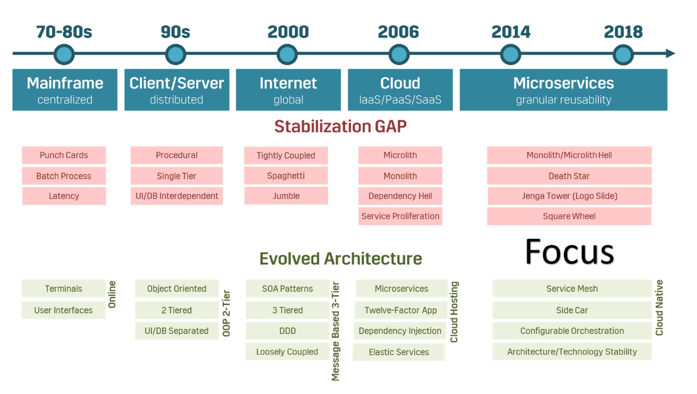

# Why Architecture

## Tailoring a bigger system.

###### {"semantic":"explanation"}

Architecture is building a bigger specialized system out of smaller general purpose components. In order to do that, the architect has to be familiar with:

*   Wanted characteristics of a new system planned for the first production release, including functional requirements, non-functional requirements and technical constraints.
*   Predict most probable extensions of the system and create an architecture that can support change
*   Poses wider knowledge about present components and important best practices on the market
*   Manage following most important implementation aspects:
    *   Define overall production, testing and development architectural image of new system (planned next bigger release): system/application/infrastructure architecture diagrams with all important decisions
    *   Reference implementation known to all team members
    *   Specific technical info for the project and how that knowledge is transferred
    *   Team experience topology and clear learning plan for team members so they can support product development
    *   Technical debt

###### {"semantic":"metaphor", "source-link":"https://www.youtube.com/watch?v=uJ603ZQQAuQ", "time-period":"00:03:24 - 00:07:09", "source-author":"Chris Holdgraf"}

Building a software system is clever composition of pre-made components

###### {"semantic":"explanation", "source-link":"https://learning.oreilly.com/library/view/designing-data-intensive-applications/9781491903063/)", "source-author":"Martin Kleppmann"}

If you have a problem such as “I want to store some data and look it up again later,” there is no one right solution, but many different approaches that are each appropriate in different circumstances. A software implementation typically has to pick one particular approach. It’s hard enough to get one code path robust and performing well—trying to do everything in one piece of software almost guarantees that the implementation will be poor.

Thus, the most appropriate choice of software tool also depends on the circumstances. Every piece of software, even a so-called “general-purpose” database, is designed for a particular usage pattern. Faced with this profusion of alternatives, the first challenge is then to figure out the mapping between the software products and the circumstances in which they are a good fit. Vendors are understandably reluctant to tell you about the kinds of workloads for which their software is poorly suited.

However, even if you perfectly understand the mapping between tools and circumstances for their use, there is another challenge: in complex applications, data is often used in several different ways. There is unlikely to be one piece of software that is suitable for all the different circumstances in which the data is used, so you inevitably end up having to cobble together several different pieces of software in order to provide your application’s functionality.

###### {"semantic":"metaphor", "source-link":"[https://www.youtube.com/watch?v=Zq2VcRZmz78&app=desktop](https://www.youtube.com/watch?v=Zq2VcRZmz78&app=desktop", "time-period":"00:35:08 - 00:39:31", "source-author":"Gregor Hohpe"}

Architecture is selling options.

## Type 1 Decisions

###### {"semantic":"why", "source-link":"https://www.infoq.com/presentations/netflix-play-api/", "time-period":"00:10:03 - 00:11:07", "source-author":"Chris Holdgraf"}

Software architecture is a set of decisions that heavily influence project future.

###### {"semantic":"explanation", "source-link":"https://www.youtube.com/watch?v=avi-TZI9t2I", "time-period":"00:01:55 - 00:04:02", "source-author":"Martin Kleppmann", "mastery":"medium"}

Use type of architecture according to the problem

## Why buy anything when open source is free?

###### {"semantic":"why"}

Price of tooling and infrastructure is a big factor in tech decisions. In order to make informed decisions, it is important to know **the full production** price of all components that are included in our overall tech solution.

It is sometimes amazingly hard to find overall software price including production usage. There are two main reasons for this:

1. One reason is that software has many use cases and variables so it is not easy to express final price without inevitable ‘it depends’ clause
2. Software providers what price too seem initially lower and when you invest your time in learning it and clouple it in your solution, it is hard to remove it so they can charge you in later phases of development further.

Those two reasons can be addressed in following ways:

1. Present price for typical use cases. However we think our system design is unique, chances are that a lot of architects have similar one. So we can use it s ‘ball park figure’ which is much better than ‘it depends’ approach.
2. Know all components and services that you will need in development and in production and sum their prices to get the final one. 

Total cost of ownership TCO is a broader concept that give useful insights into software component costs.

### Proprietary software referent prices

#### SQL Server

**For developer**: free

**For production**: Express/Developer free, Standard 3-6k $ (per core), Enterprise 15-50k $  (per core)

**Comment**: Express has storage limit up to 10GB (excluding log file) and 1GB of RAM making it not suitable for any production with concurrent access. Good for small office or desktop app.

#### Oracle

**For developer**: free

**For production**: Express/Developer free, Standard 15-30k $ (per core), Enterprise 50-100k $  (per core)

**Comment**: Express has storage limit up to 12GB and 2GB of RAM making it not suitable for any production with concurrent access. 

#### AWS Small/Medium Size App

DB+App Server+Replication+Route 53 = 300-600 eur/month

Note: Not small DB server 64GB RAM, 0.5TB SSD, 8 cores, cost about 5k $ per year

### Open source business model and referent prices

###### {"semantic":"explanation", "inspired-by":"https://www.influxdata.com/blog/the-open-source-database-business-model-is-under-siege/", "source-author":"Paul Dix", "source-details":"Paul speaks from perspective of an open source creator and here we have a perspective of an architect who used it"}

The development of open source software is **always** subsidized. Either through programmers’ free time when they’d be doing something else, investor dollars, donations, or some other successful business, like a search advertising business, for example. Usual open source business model (or how they make money on you) are:

*   Consulting and professional services \
Buy accumulated knowledge in a particular area around the tool that is in heads of consultants. This prevents you having ‘cold start’ in some technology and making expensive mistakes not having production experience. \
Usual prices for such a service is about 100 eur/h and usual time duration is 5-10 man days. \
Big cloud provides like AWS offer this for free if you are in their licensing program.
*   Support subscription \
Similar as consulting but this is related to tech support directly related to tool usage. Tool provider strives to make the tool easy for development and production so it should not be necessary for you to get a huge amount of this services for mature tools and you will need it in the initial phase of development and production usage.
*   OEM \
This covers both OEM use cases - when hardware producer ships product together with software and second when the tool is part of a bigger software system. You pay here for OEM licence which is one time price or percentage of your sell. For example MySQL OEM GPL licence
*   Closed source production tooling & monitoring \
One portion of the product is free and open source but in order to use it on production level or on level that satisfies significant usage, you have to add components that are not free or open source. This is where open source companies earn money and what is not visible at the first sight to architects. \
Cloud vendors take open source product and run it on their infrastructure complementing additional production level services from their capacities. For example, AWS is hosting Elastic search augmenting it with their monitoring services so you don’t have to buy Elastic monitoring component which hurts Elastic. This is the reason of existence of ‘Open Core’ model. \
Anyway, architect has to be aware that Elastic is not enough on its own without monitoring which is not free.
*   Open Core and closed commercial fork \
Similar to ‘production tooling’ model, open source is core tool which is not sufficient for production so you have to buy another version of similar tool for production.
*   SaaS \
Open source products offered as SaaS which is much more convenient for usage and don’t require admin/devops capacities on your side. Usage is not free - it is tradeoff between your operational cost inhouse and licence that you are going to pay to the provider. Model is similar to Cloud provides model for just one tool. \
Hosting the product on your own has less and less sense since prices of SaaS are in decrease.

#### MySQL

###### {"semantic":"explanation", "inspired-by":"https://severalnines.com/database-blog/calculating-total-cost-ownership-mysql-management", "source-author":"Art van Scheppingen"}

**Community edition**: free and open source GPL

**Standard/enterprise/cluster**: 2-10k yearly including security, monitoring, document store, partitioning, support

**TCO**: 60k $ on prem, 80k $ cloud (3 years CAPEX + OPEX, cluster of 3 servers each 64GB RAM, 400GB SSD, 8 cores), Cloud more expensive

#### PostgreSQL

Free under the [PostgreSQL License](http://www.opensource.org/licenses/postgresql), a liberal Open Source license, similar to the BSD or MIT licenses.

There is enterprise version under name [EnterpriseDB](https://www.enterprisedb.com/pricing).

#### Kafka

Open source Apache License 2.0

AWS managed service price per month: 600$

#### Cassandra

Open source Apache License 2.0

AWS managed service price per month: 600$

### History of architecture

###### {"semantic":"explanation", "source-link":"https://www.infoq.com/articles/cloud-native-architecture-adoption-part1/"}

Mainframe

*   Centralized architecture phase (centralized data storage and computing model), paradigm of a massive central unit with "one size fits all" approach
*   basic client terminals
*   batch processes (via punch cards)
*   Expensive exclusive computing 

Client/server

*   Centralized -> decentralized transition phase
*   most of the logic on the server side and some of the processing on the client
*   first attempt in distributed computing
*   Spotted problem of single-tier - ‘Big ball of mud’ 
*   OOP and three-tier architecture as a solution to deal with decentralization
*   Spotted problem of needing to install the client application on every user’s computer and an inability to scale at a fine-grained level as a business function.

Internet

*   Decentralized -> connected/shared (www) phase
*   Web browsers became the client, community migrate from thick (desktop) clients to thin (web) clients
*   ‘Big ball of mud’ and integration of already bought monoliths - solutions: SOA , DDD and Enterprise Integrational Patterns
*   true three-tier architecture with presentation (UI) code hosted on web servers, business logic (API) on application servers, and the data stored in database servers.

Cloud

*   VM-hosted -> cloud-hosted
*   hosting as a service, managed provisioning to support scale, reliability and cost efficiency
*   modular deployment supported by infrastructure

Microservices

*   Fine-grained reusability
*   DevOps as a role
*   Smart endpoints and dumb pipes
*   Microlith antipattern (tightly coupled, intermingled microservices) and ‘Death start’ antipattern
*   Emerging architecture patterns like service mesh, sidecar, service orchestration, containers and modular monolith. They offload these capabilities from application- level libraries and allows developers to focus on business logic
*   Service mash: traffic control, service discovery, load balancing, resilience, observability, security, chaos injection
*   Serverless goes a step further than the PaaS model in that it fully abstracts server infrastructure from the application developers.

## Diagrams visualizations

###### {"semantic":"explanation", "source-link":"https://www.youtube.com/watch?v=x2-rSnhpw0g", "time-period":"00:06:05 - 00:35:25", "source-author":"Simon Brown"}

C4 model
